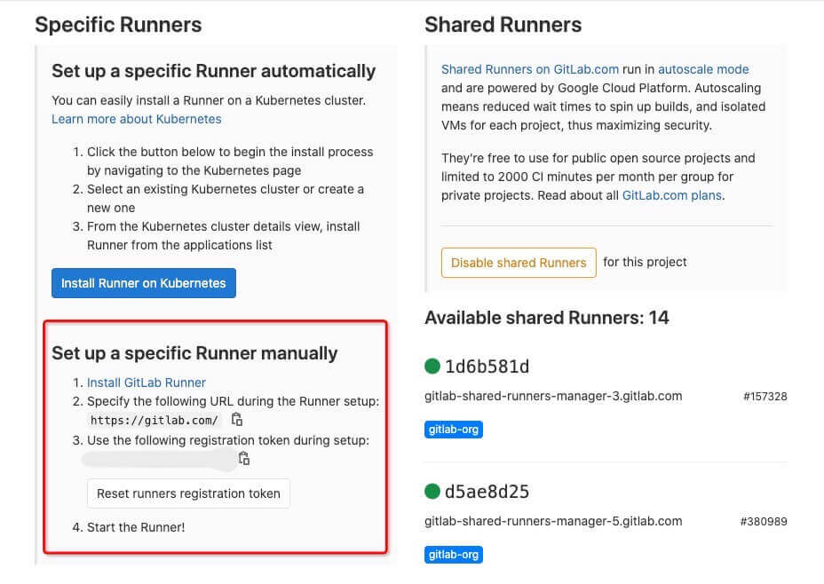
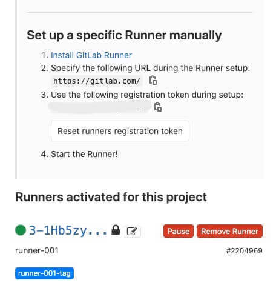
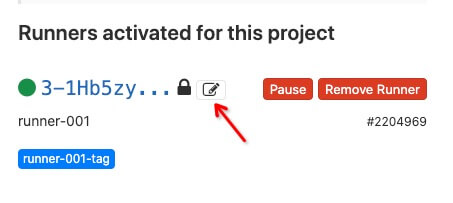
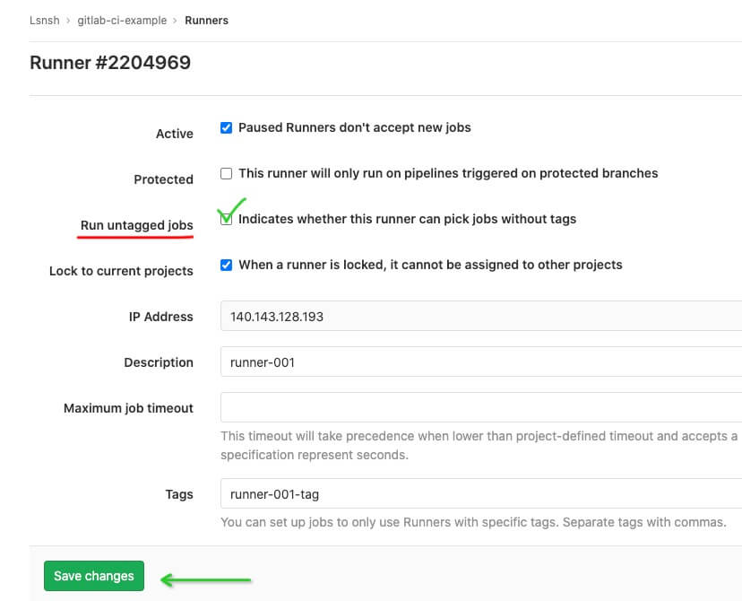
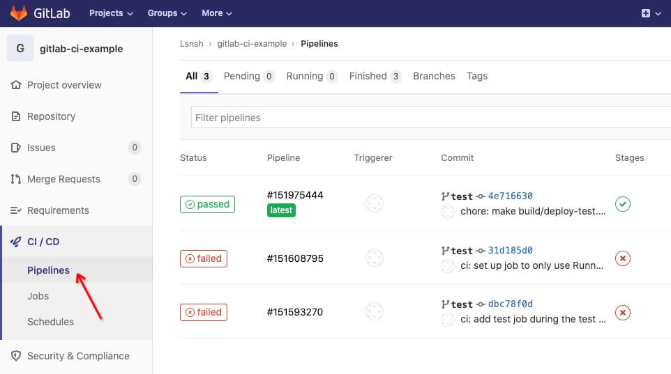
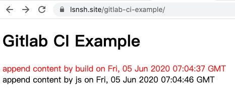

# Gitlab-CI-Example

由于日常构建/部署等一些重复工作都是 `GitLab CI` 帮我们完成，对此一直很好奇，尝试自己在项目中引入 `GitLab CI` 并做一些总结——[搭建一个使用 GitLab CI 的项目](https://www.lsnsh.site/2020/03/create-gitlab-ci-cd-example-project/)，于是就有了这个配套的示例项目。

## 初始化

### 安装依赖

```shell
npm install
```

### 开发

```shell
npm run dev
```

在浏览器中打开链接：http://localhost:8090/ ，你应该能看到：


### 构建

```shell
npm run build
```

在浏览器中打开 `dist` 目录下的 `index.html` 文件，你应该能看到：


## 项目中使用 GitLab CI

使用 `GitLab CI`之前，你得先准备一下：

- 一台云服务器
- 一个 `GitLab` 仓库

### 设置 GitLab Runner

在仓库主页，点击侧边栏 - `Settings` - `CI / CD`，跳转 `CI / CD Settings` 页面，展开 `Runners` 选项，按步骤手动设置 `GitLab Runner`：



#### 安装 GitLab Runner

根据系统架构，下载并安装对应的软件包，[查看详情][2]

```bash
# 下载（适用于amd64的软件包）
curl -LJO https://gitlab-runner-downloads.s3.amazonaws.com/latest/deb/gitlab-runner_amd64.deb

# 如果下载太慢，建议在本地下载好之后，通过scp命令复制到远程，类似这样
# scp ~/gitlab-runner_amd64.deb yourUserName@yourIPAddress:/home/yourUserName

# 安装
sudo dpkg -i gitlab-runner_amd64.deb
# 输出
Selecting previously unselected package gitlab-runner.
(Reading database ... 67015 files and directories currently installed.)
Preparing to unpack gitlab-runner_amd64.deb ...
Unpacking gitlab-runner (13.0.1) ...
Setting up gitlab-runner (13.0.1) ...
GitLab Runner: detected user gitlab-runner
Runtime platform                                    arch=amd64 os=linux pid=28968 revision=21cb397c version=13.0.1
gitlab-runner: Service is not installed.
Runtime platform                                    arch=amd64 os=linux pid=28975 revision=21cb397c version=13.0.1
gitlab-ci-multi-runner: Service is not installed.
Runtime platform                                    arch=amd64 os=linux pid=28993 revision=21cb397c version=13.0.1
Runtime platform                                    arch=amd64 os=linux pid=29039 revision=21cb397c version=13.0.1

# 如果你收到类似上面的报错，运行下面的命令，如果能输出信息表示正常
sudo gitlab-runner status
# 输出
Runtime platform                                    arch=amd64 os=linux pid=29971 revision=21cb397c version=13.0.1
gitlab-runner: Service is running!
```

对于上面的报错信息，可以看看这个 [gitlab issue][4]

#### 注册 GitLab Runnner

开始注册，下面是 `Linux` 的例子，[其他系统请看这里][3]

```bash
# 注册
sudo gitlab-runner register
# 输出
Runtime platform                                    arch=amd64 os=linux pid=31237 revision=21cb397c version=13.0.1
Running in system-mode.

# 指定 GitLab 实例 URL
Please enter the gitlab-ci coordinator URL (e.g. https://gitlab.com/):
https://gitlab.com/

# 输入注册令牌（从项目-设置-CI/CD 设置-Runners 那里拷贝）
Please enter the gitlab-ci token for this runner:
JhXh7o********yDXATd

# 输入描述
Please enter the gitlab-ci description for this runner:
[hostname]: runner-001

# 输入关联标签
Please enter the gitlab-ci tags for this runner (comma separated):
runner-001-tag
# 输出
Registering runner... succeeded                     runner=JhXh7oEx

# 选择执行环境，这里选择的是 shell
Please enter the executor: virtualbox, docker-ssh+machine, kubernetes, parallels, shell, ssh, docker+machine, custom, docker, docker-ssh:
shell
# 输出
Runner registered successfully. Feel free to start it, but if it\'s running already the config should be automatically reloaded!
```

下载安装并注册完 `Runner` 后，返回 `CI / CD Settings` 页面，现在应该能看到项目关联的 `Runner`



### 配置 GitLab CI

设置完 `GitLab Runner` 后，我们就可以开始配置 `GitLab CI` 了，新建 `.gitlab-ci.yml` 文件

> gitlab-ci-example/.gitlab-ci.yml

```yml
# 工作名称
job-test:
  # 阶段
  stage: test
  # 触发条件：test 分支更新时
  only:
    - test
  # 指定工作给具有特定标签的 Runners
  tags:
    - runner-001-tag
  # 脚本
  script:
    - npm install
    - npm run build
    - npm run deploy-test
```

默认情况下 `GitLab Runner` 不会运行没有 `tags` 的工作，所以这里我们指定注册 `GitLab Runner` 时候设置的标签：`runner-001-tag`，[查看更多 GitLab CI/CD 配置选项][6]

如果你不想设置 `tags`，可以修改 `GitLab Runner` 的配置，勾选 `Run untagged jobs`，表示允许 `GitLab Runner` 运行没有设置 `tags` 的任务。




保存 `.gitlab-ci.yml` 文件后，将改动 `push` 到远程仓库

### 触发 GitLab CI

配置文件有了之后，我们需要将其触发，从包含上面改动的分支，切出一个 `test` 分支，提交到远程，用于触发 `GitLab CI`（新提交和合并 `test` 分支都会触发 `CI` ），当然通过图形化界面创建 `test` 分支也是可以的

```
git checkout test
git push -u origin test
```

在仓库主页，点击侧边栏 - `CI / CD` - `Pipelines`，就能看到当前仓库所有的 `CI` 记录，类似下面这样：



---

## 遇到的问题

### 1. mkdir: cannot create directory ‘/home/gitlab-runner/builds/3-1Hb5zy’: Permission denied

```bash
 Running with gitlab-runner 13.0.1 (21cb397c)
   on runner-001 3-1Hb5zy
Preparing the "shell" executor 00:00
 Using Shell executor...
Preparing environment 00:00
 Running on xx-ubuntu...
Getting source from Git repository 00:00
 mkdir: cannot create directory ‘/home/gitlab-runner/builds/3-1Hb5zy’: Permission denied
Uploading artifacts for failed job 00:00
 mkdir: cannot create directory ‘/home/gitlab-runner/builds/3-1Hb5zy’: Permission denied
 ERROR: Job failed: exit status 1
```

**原因：**

将代码 `push` 到远程之后，构建出现了上面的报错，`GitLab Runner` 构建时使用的是 `gitlab-runner` 用户，创建目录的时候提示权限不足，尝试查看目录信息：

```bash
# 查看文件和目录信息
ls -alF /home/gitlab-runner
# drwxr-xr-x 4 root          root          4096 Jun  2 17:45 builds/
```

当前目录的权限和权限组都是 `root` ，`gitlab-runner` 用户不在 `root` 权限组下，所以没权限操作。

仔细想想 🤔 发现不对劲，`GitLab Runner` 构建时使用的是 `gitlab-runner` 用户，但是为什么 `builds` 目录在 `root` 权限组下？回想一下在此之前做过哪些和 `root` 用户相关的操作，经过确认和查阅资料后发现，原来是在这次构建之前，手动安装服务（`gitlab-runner install`）的时候指定使用 `root` 用户（`--user root`）导致的：

```bash
# 安装服务，指定工作目录，指定运行任务的用户为 root 用户
sudo gitlab-runner install --working-directory /home/gitlab-runner --user root
```

**如何解决：**

删除 `builds` 目录、卸载重装 `gitlab-runner` 服务，将服务关联的用户指回 `gitlab-runner` 用户

```bash
# 停止服务
sudo gitlab-runner stop
# 卸载服务
sudo gitlab-runner uninstall
# 重新安装服务，指定工作目录和用户
sudo gitlab-runner install --working-directory /home/gitlab-runner --user gitlab-runner
# 完整配置
# sudo gitlab-runner install --working-directory /home/gitlab-runner --config /etc/gitlab-runner/config.toml --service gitlab-runner --syslog --user gitlab-runner
# 校验
sudo gitlab-runner verify
# 启动服务
sudo gitlab-runner start
# 查看状态
sudo gitlab-runner status
```

```bash
# 再次查看文件和目录信息
ls -alF /home/gitlab-runner
# drwxrwxr-x 3 gitlab-runner gitlab-runner 4096 Jun  3 16:21 builds/
```

现在 `builds` 目录的权限归回 `gitlab-runner` 用户所有了，在 `gitlab` 仓库的 `Pipelines` 或 `Jobs` 页面找到这次工作关联的 `retry` 按钮，点击按钮尝试重新运行构建

### 2. bash: line 92: npm: command not found

```bash
 Running with gitlab-runner 13.0.1 (21cb397c)
   on runner-001 3-1Hb5zy
Preparing the "shell" executor  00:00
 Using Shell executor...
Preparing environment 00:00
 Running on VM-0-5-ubuntu...
Getting source from Git repository  00:03
 Fetching changes with git depth set to 50...
 Reinitialized existing Git repository in /home/gitlab-runner/builds/3-1Hb5zy/0/Lsnsh/gitlab-ci-example/.git/
 Checking out 4e716630 as test...
 Skipping Git submodules setup
Restoring cache 00:00
Downloading artifacts 00:00
Running before_script and script  00:00
 $ npm install
 bash: line 92: npm: command not found
Running after_script  00:00
Uploading artifacts for failed job  00:00
 ERROR: Job failed: exit status 1
```

**原因：**

重装服务后 `retry` 构建后，出现了上面的报错，原因是因为 `gitlab-runner` 用户所处的环境没有安装 `node` 导致的（默认情况下在 `root` 或者其他用户上安装的 `node` 在 `gitlab-runner` 用户所处环境是访问不到的）

**如何解决：**

登录服务器，切换到 `gitlab-runner` 用户，安装 `nvm`，再安装 `node`

```bash
# 切换到 root 用户
sudo su
# 登录 gitlab-runner 用户
su -l gitlab-runner
# 安装 nvm（https://github.com/nvm-sh/nvm），如果访问脚本443，尝试用其他方式安装 nvm 或者直接安装 node
curl -o- https://raw.githubusercontent.com/nvm-sh/nvm/v0.35.3/install.sh | bash
# 查看 nvm
nvm ls
# 安装 node（截止目前最新LTS版本为：12.18.0，自行选择版本安装）
nvm install 12.16.2
# 查看 node 和 npm 版本
node -v
npm -v
```

现在 `gitlab-runner` 用户所处环境已经安装 `node` 了，高兴的尝试 `retry` 后，发现依然是 `bash: line 92: npm: command not found`，一度以为是错觉、是服务没有检测到 `node` 的存在，尝试重装、重启 `gitlab-runner` 服务后 `retry` 依然是 `failed`。

冷静一番后，查阅大量类似案例，初步判断可能是环境变量没加载，也就是 `nvm` 没有加载导致的，尝试在构建过程中手动加载 `~/.bashrc` 文件：

```yml
before_script:
  - source ~/.bashrc
```

重新 `retry` 后依然还是 `failed`，最后还是在 `~/.profile` 和 `~/.bashrc` 两个配置文件头部的一些注释信息里，找到了一些新的灵感：

**~/.profile**

```bash
# ~/.profile: executed by the command interpreter for login shells.
# ...
```

直译过来：`~/.profile`: 由命令解释器针对登录 `shell` 执行。

**~/.bashrc**

```bash
# ~/.bashrc: executed by bash(1) for non-login shells.
# ...
```

直译过来：`~/.bashrc`：由 `bash（1）` 对非登录 `shell` 执行。

以上信息中提到了登录与非登录两种状态，配置文件在对应状态下才会执行，通过添加调试信息发现，在 `gitlab-runner` 执行任务构建时，不会加载 `~/.bashrc` 文件，只会加载 `~/.profile` 文件；而通过 `ssh` 登录服务器时，两个文件都会加载，是不是有些疑惑 🤔，这是因为 `~/.profile` 文件在开头会根据环境（`bash`）决定是否要先加载 `~/.bashrc` 文件，具体代码如下：

```bash
# ~/.profile: executed by the command interpreter for login shells.
# This file is not read by bash(1), if ~/.bash_profile or ~/.bash_login
# exists.
# see /usr/share/doc/bash/examples/startup-files for examples.
# the files are located in the bash-doc package.

# the default umask is set in /etc/profile; for setting the umask
# for ssh logins, install and configure the libpam-umask package.
#umask 022

# if running bash
if [ -n "$BASH_VERSION" ]; then
    # include .bashrc if it exists
    if [ -f "$HOME/.bashrc" ]; then
	. "$HOME/.bashrc"
    fi
fi
```

要解决 `npm` 命令找不到这个问题，需要在 `~/.profile` 配置文件添加上加载 `nvm` 的代码：

```bash
# 编辑配置文件
vi ~/.profile
# 配置 nvm 加载，将下面的代码添加到配置文件中（https://github.com/nvm-sh/nvm#installing-and-updating）
export NVM_DIR="$([ -z "${XDG_CONFIG_HOME-}" ] && printf %s "${HOME}/.nvm" || printf %s "${XDG_CONFIG_HOME}/nvm")"
[ -s "$NVM_DIR/nvm.sh" ] && \. "$NVM_DIR/nvm.sh" # This loads nvm
# 保存配置文件后，重新加载配置文件
source ~/.profile
```

### 3. sh: 1: build/deploy-test.sh: Permission denied

```bash
$ npm run deploy-test
> gitlab-ci-example@1.0.0 deploy-test /home/ubuntu/builds/3-1Hb5zy/0/Lsnsh/gitlab-ci-example
> build/deploy-test.sh
sh: 1: build/deploy-test.sh: Permission denied
npm ERR! code ELIFECYCLE
npm ERR! errno 126
npm ERR! gitlab-ci-example@1.0.0 deploy-test: `build/deploy-test.sh`
npm ERR! Exit status 126
npm ERR!
npm ERR! Failed at the gitlab-ci-example@1.0.0 deploy-test script.
# ...
```

**原因：**

```bash
# 在项目构建目录下（类似：/home/ubuntu/builds/3-1Hb5zy/0/Lsnsh/gitlab-ci-example），查看部署脚本的权限信息
ls -alF ./build/deploy-test.sh
# -rw-rw-r-- 1 ubuntu ubuntu   42 Jun  2 19:40 deploy-test.sh
```

通过以上命令发现和搜索[相关问题][5]，发现 `deploy-test.sh` 文件不具备可执行权限，所以无法执行

**如何解决：**

1. 直接更改 `deploy-test.sh` 文件权限

```bash
# 表明 deploy-test.sh 文件是可执行的
git update-index --chmod=+x ./build/deploy-test.sh
# 改动会直接进入暂存区，编辑器的 git state 可能表明还有新的更改，忽略后直接提交本次更改后，git state 的状态会更新
git commit -m 'Make build.sh executable'
# 提交到远程，master, test 或者其他分支
git push
```

2. 通过 `sh` 命名执行 `deploy-test.sh` 文件

```diff
# package.json
- "deploy-test": "build/deploy-test.sh",
+ "deploy-test": "sh build/deploy-test.sh",
```

### 4. /www/test/gitlab-ci-example: No such file or directory

```bash
$ npm run deploy-test
> gitlab-ci-example@1.0.0 deploy-test /home/gitlab-runner/builds/3-1Hb5zy/0/Lsnsh/gitlab-ci-example
> build/deploy-test.sh
/www/test/gitlab-ci-example: No such file or directory
Please create this directory and then assign the directory permissions to the gitlab-runner user.
You can execute the following command as root:
mkdir /www/test/gitlab-ci-example
chown gitlab-runner /www/test/gitlab-ci-example
```

**原因：**

`build/deploy-test.sh` 脚本会将构建好的代码，拷贝到 `/www/test/gitlab-ci-example` 目录下，因此在构建之前需要先创建好这个目录

**如何解决：**

参考 `build/deploy-test.sh` 脚本中打印出的提示信息，新建并分配目录权限即可：

```bash
# 新建目录（使用 root 用户或者其他 gitlab-runner 用户以为的用户）
mkdir /www/test/gitlab-ci-example
# 分配 gitlab-runner 用户文件夹权限
chown gitlab-runner /www/test/gitlab-ci-example
```

---

## 总结

至此，`CI` 终于可以跑通了，部署后页面的内容是这样的，[点击查看][7]：



通过 `.gitlab-ci.yml` 配置文件，你可以在构建的各个阶段做处理，比如你可以在 `before_script` 和 `after_script` 阶段调用钉钉机器人接口，及时将部署状态同步到个人/群：

```yml
before_script:
  # 钉钉通知 钉钉群
  - curl -X POST 'https://oapi.dingtalk.com/robot/send?access_token=xxx&xxxx'
```

通知类似下面这样：


更多关于 `.gitlab-ci.yml` 文件的配置信息，请看[官方文档][6]

好利用 `CI / CD` 这件工具，相信会大大提升团队协作和开发效率。万事开头难，起初肯定会有抵触心理，迈过这道坎之后，还有下一道坎等着你[手动狗头]

示例项目的仓库链接如下，欢迎 `star` 🌟：

`github` 仓库（`template`）：https://github.com/Lsnsh/gitlab-ci-example

`gitlab` 仓库：https://gitlab.com/Lsnsh/gitlab-ci-example

---

## 命令汇总

```bash
# 查看 gitlab-runner 相关进程
ps aux|grep gitlab-runner

# 注册 gitlab-runner
sudo gitlab-runner register

# 重装 gitlab-runner 服务
# 停止服务
sudo gitlab-runner stop
# 卸载服务
sudo gitlab-runner uninstall
# 重新安装服务，指定工作目录和用户
sudo gitlab-runner install --working-directory /home/gitlab-runner --user gitlab-runner
# 完整配置
# sudo gitlab-runner install --working-directory /home/gitlab-runner --config /etc/gitlab-runner/config.toml --service gitlab-runner --syslog --user gitlab-runner
# 校验
sudo gitlab-runner verify
# 启动服务
sudo gitlab-runner start
# 查看状态
sudo gitlab-runner status

# 拷贝文件到远程主机
# scp ~/gitlab-runner_amd64.deb yourUserName@yourIPAddress:/home/yourUserName
# eg: (将文件 ~/gitlab-runner_amd64.deb 拷贝到远程主机，公网 IP 为 110.120.130 的 root 用户目录下)
scp ~/gitlab-runner_amd64.deb root@110.120.130:/home/root

# 查看文件和目录信息
# eg: (查看 /home/gitlab-runner 目录)
ls -alF /home/gitlab-runner

# 切换到 root 用户
sudo su
# root 用户登录其他用户
# eg: (登录 gitlab-runner 用户)
su -l gitlab-runner

# 表明文件是可执行的
# git update-index --chmod=+x 文件路径
# 表明文件是不可执行的
# git update-index --chmod=-x 文件路径
# eg: (表明 ./build/deploy-test.sh 文件是可执行的)
git update-index --chmod=+x ./build/deploy-test.sh

# 给用户分配文件或文件夹权限
# chown 用户名 文件或文件夹路径
# eg: (分配 gitlab-runner 用户 /www/test/gitlab-ci-example 文件夹权限)
chown gitlab-runner /www/test/gitlab-ci-example
```

## 参考链接

- [Install GitLab Runner][2]
- [Registering Runners][3]
- [Error when installing gitlab-runner][4]
- [Permission denied for build.sh file][5]
- [GitLab CI/CD Pipeline Configuration Reference][6]
- [Gitlab CI Failed: NPM command not found][8]
- [How to create file execute mode permissions in Git on Windows?][9]

[1]: https://github.com/Lsnsh/gitlab-ci-example
[2]: https://docs.gitlab.com/runner/install/
[3]: https://docs.gitlab.com/runner/register/
[4]: https://gitlab.com/gitlab-org/gitlab-runner/-/issues/3312
[5]: https://stackoverflow.com/questions/42154912/permission-denied-for-build-sh-file
[6]: https://docs.gitlab.com/ee/ci/yaml/README.html
[7]: https://www.lsnsh.site/gitlab-ci-example/
[8]: https://stackoverflow.com/questions/44754611/gitlab-ci-failed-npm-command-not-found
[9]: https://stackoverflow.com/questions/21691202/how-to-create-file-execute-mode-permissions-in-git-on-windows
[10]: https://gitlab.com/Lsnsh/gitlab-ci-example
